# Downloading and installing the Nature Braid Python toolbox using GitHub Desktop

This guide shows how to download and install the Nature Braid toolbox using GitHub Desktop. The Nature Braid codebase is hosted on GitHub [here](https://github.com/lucitools/LUCItools). Having a GitHub repository allows developers to make changes and update the code easily, and allow users to pull down these updates. GitHub Desktop is a Git GUI programme that allows both developers and users to push changes and pull down updates using a visual interface.

## How to download Nature Braid

1. Create a [GitHub](https://github.com/) account if you do not already have one. Once you have done this, e-mail the Nature Braid development team so we can give you access to the GitHub repository.

2. Once the team gives you access, you will get an e-mail from GitHub saying you have been invited. Accept the invite and you will have access to the codebase.

3. Download the GitHub Desktop [here](https://desktop.github.com/) (accessed 05/12/2022) and install it.

4. Once it finishes installing, it automatically launches to the splash screen below. Click _Sign in to GitHub.com_.

    

5. Clicking this button will open your internet browser to GitHub and prompt you to log in. After logging in, you will be prompted to authorise GitHub Desktop to access your account. It needs this to understand which private repositories you have been added to. Click _Authorize desktop_.

  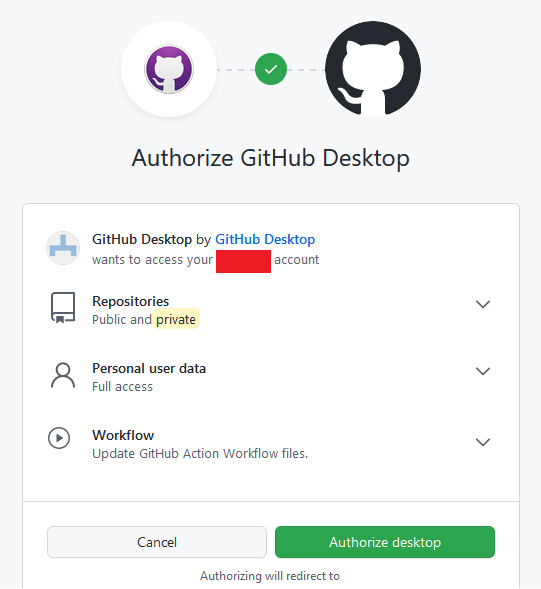

6. After this, the browser will attempt to open GitHub Desktop and you may see a prompt like below. Click *Open Link*.

    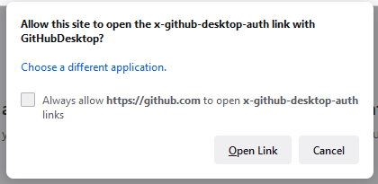

7. Back in GitHub Desktop, it will ask you how you want to configure your Git. This will identify any changes you make to repositories if you are a developer and have can make updates to the code. You may choose to use just your GitHub details or make a new configuration.

    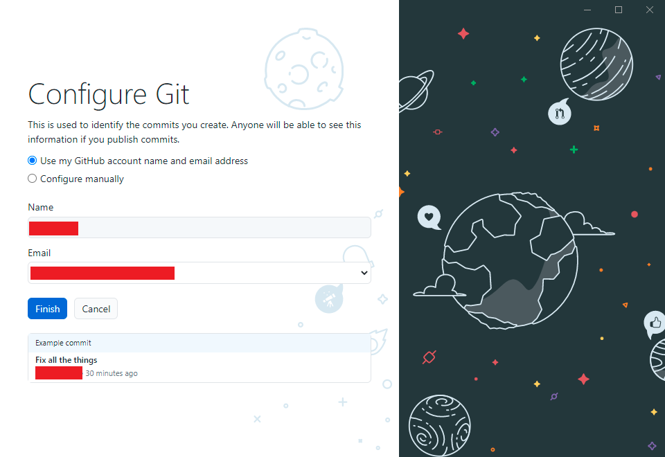

8. Then you will be taken to this page where you see options to clone repositories, do a tutorial, or add an existing one from your hard drive. You may also see your own repositories on the right-hand side of the screen. Click *Clone a repository from the Internet...*.

    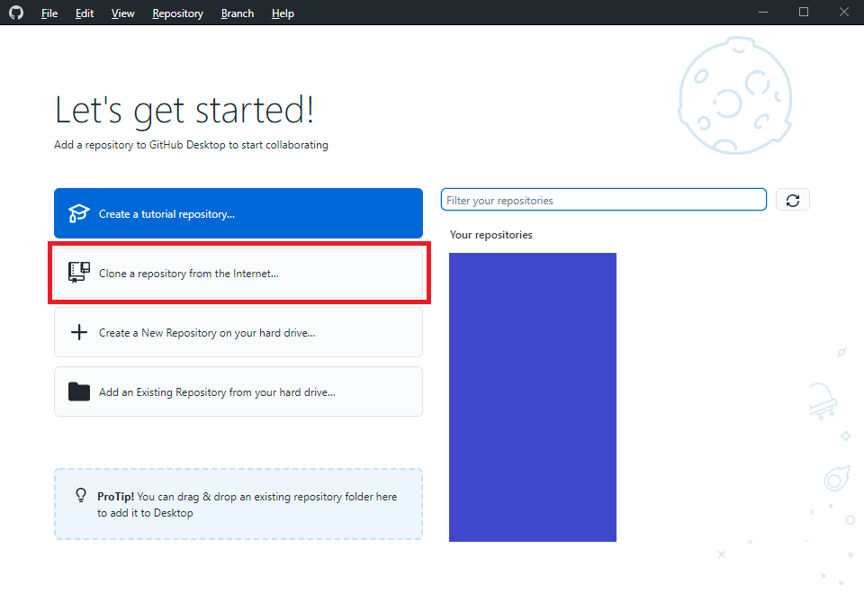

9. When you click this, the Clone a repository dialogue box will show up. Click URL out of the three options and fill in the following information:

- The URL shoud be to the LUCItools repository on GitHub (**https://github.com/lucitools/LUCItools**)

- The local path should be **C:\LUCI\LUCItools** (or in a similar location accessible to you on your PC). Note that the name of the folder being “LUCItools” with this spelling and capitalisation is crucial for maintaining the correct folder structure for the code.

    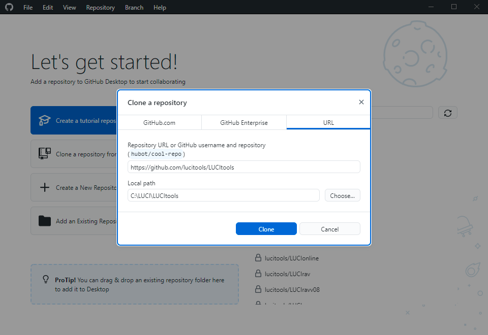

10. Click *Clone* and the program will start downloading the codebase.

    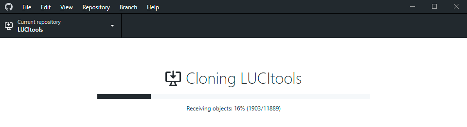

11.	By default, the code pulls down the *master* branch. To ensure you have the latest code, click the *Current branch* button below.

    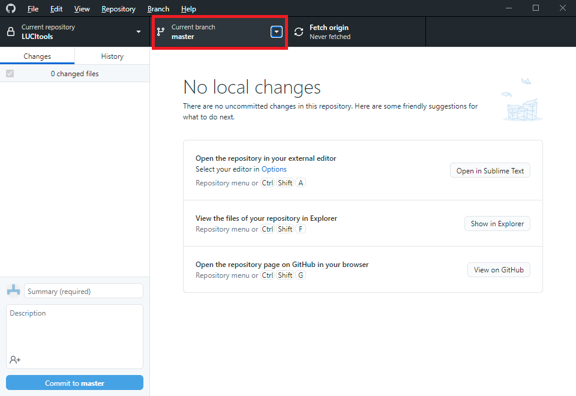

12. Click the *origin/nextgen* option which contains the latest code.

    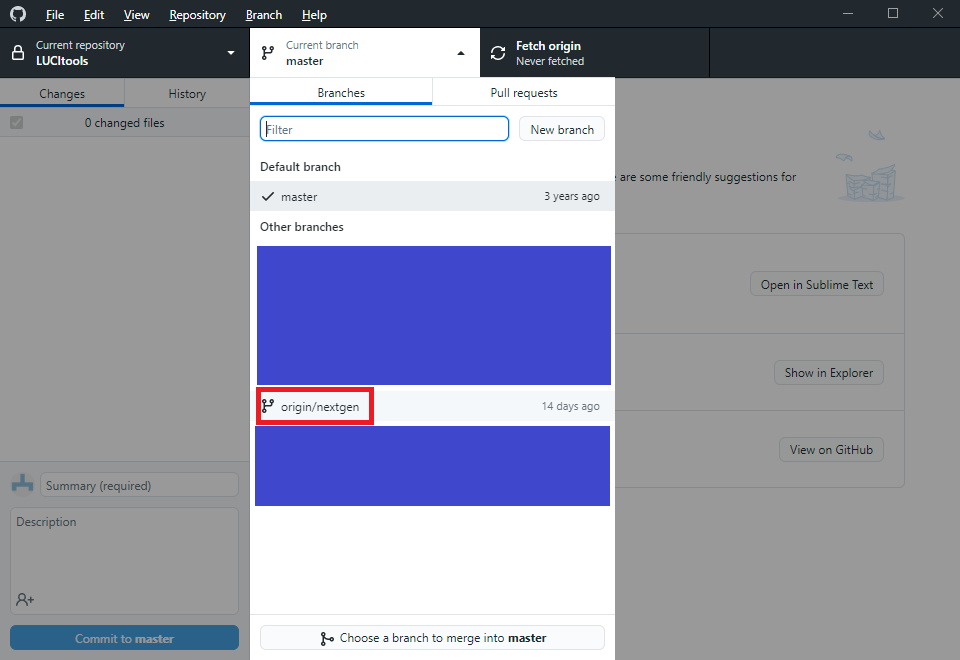

13.	After this, notice that the arrows in the button are now moving and the text reads *origin/nextgen*.

    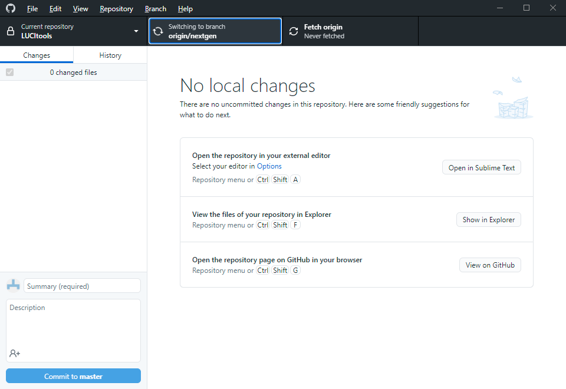

14. Once the arrow finishes spinning, the text in that button should now read *Current branch: nextgen*.

## Installing the toolbox in ArcMap

Note: Although this section shows ArcMap, the same steps can be taken in ArcGIS Pro to add the toolbox to that program's catalog window.

1. To add the toolbox to ArcMap, open ArcMap. In the Catalog window (if you do not see the Catalog window, open it by going to *Windows > Catalog*), click the *Connect To Folder* button.

    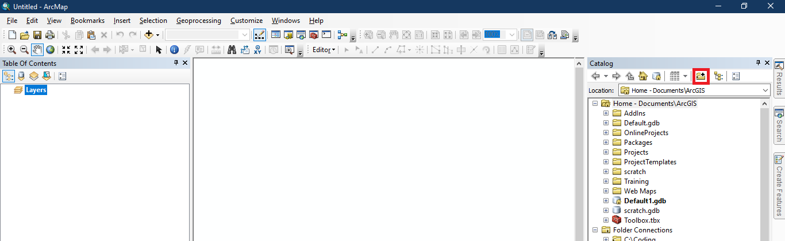

2. The dialogue box below will open. Navigate to the **C:\LUCI\LUCItools** folder or the place where you saved it onto your PC. Click *OK*.

    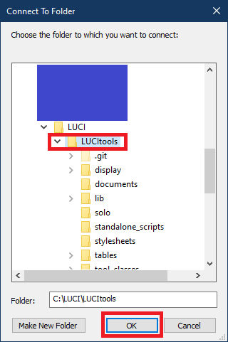
    
3. Back in ArcMap’s Catalog window, open the folder you just connected. Notice that now you can see the LUCI_tools.pyt toolbox, and are ready to run the tool.

    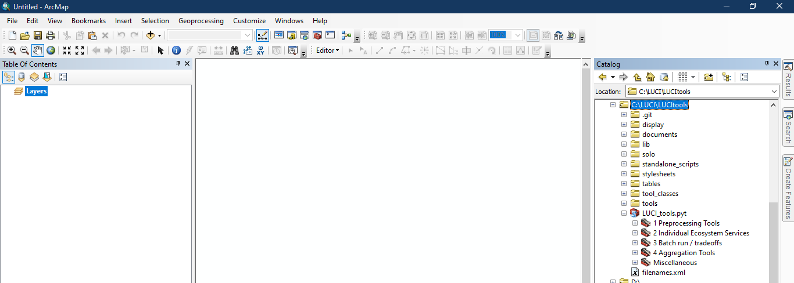

## How to pull down updates

1. To check for updates to the code, click the Fetch origin button.

    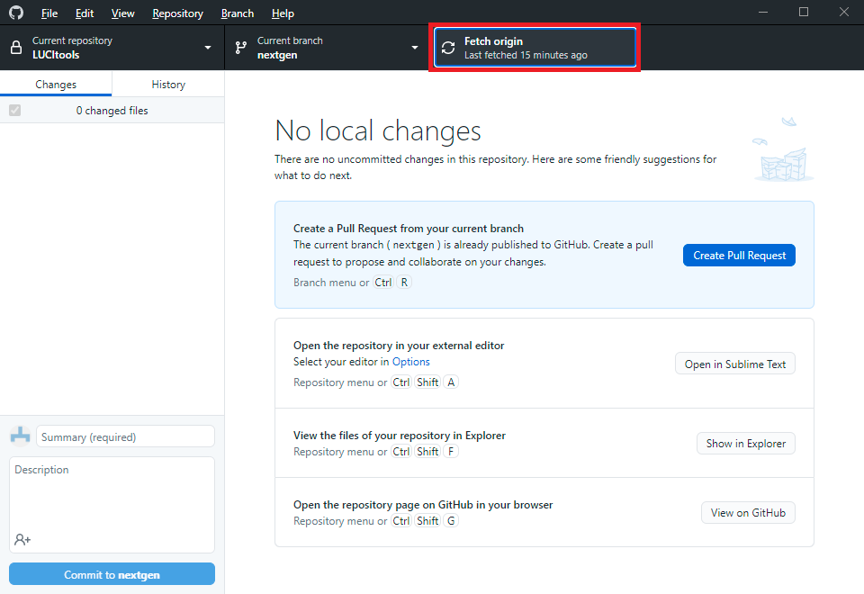

2. If there are updates in the code, the button will change to Pull origin along with displaying the number of code changes with an arrow pointing downwards. Click Pull origin (either the black button or blue button will work).

    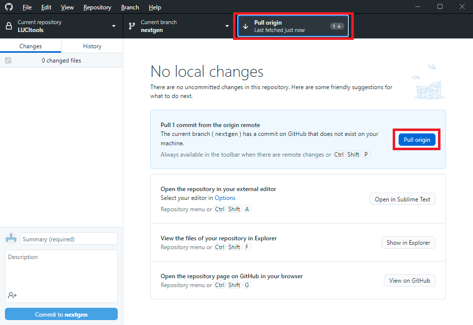
