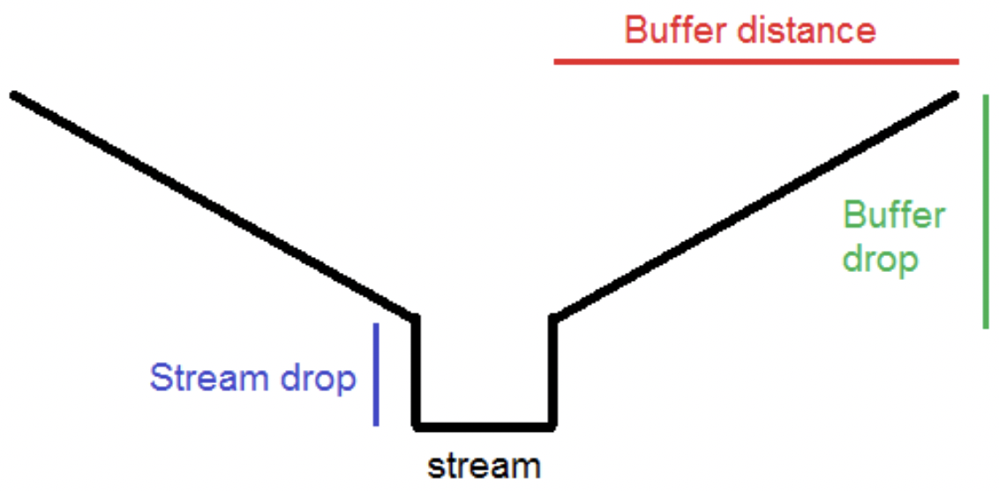

# Miscellaneous

This section contains standalone tools and functions, and are described briefly.

## Batch clip results and produce statistics (batch run folder)
### Summary
This tool requires the *Generate Baseline* and *Batch run ecosystem services* tools to have been previously run, and optionally the RUSLE tool to have been run, for one large study area such as a catchment, region, or farm. This tool accepts a shapefile of this study area with sub-polygons defining aggregation units such as sub-catchments, sub-regions, or paddocks.

It will loop through each sub-polygon and clip the baseline and ecosystem services tools to the extent of each sub-polygon, as well as summarise the ES statistics as CSV files.

### Inputs
- **Output: Folder for clipped extent from all input folders:** Specify the path and name of the folder where output from this tool will be stored.

- **Input: clip extent shapefile or feature class:** Specify the path and filename of the shapefile that defines the aggregation zones (e.g. catchment file with subcatchments, farm file with paddocks, etc).

- **Input: Original/full baseline folder:** Specify the path and name of the folder containing the output from the *Generate Baseline* tool for the full area of interest.

- **Input: Original/full batch run folder:** Specify the path and name of the folder containing the output from the *Batch run ecosystem services* tool for the full area of interest.

- **Clip agricultural productivity results:** Tick this box if clipping agricultural productivity results is desired.

- **Clip carbon results:** Tick this box if clipping carbon results is desired.

- **Clip erosion (CTI) results:** Tick this box if clipping erosion and sediment results is desired.

- **Clip flood mitigation results:** Tick this box if clipping flood mitigation results is desired.

- **Clip habitat connectivity results:** Tick this box if clipping habitat connectivity results is desired.

- **Clip nitrogen results:** Tick this box if clipping nitrogen results is desired.

- **Clip phosphorus results:** Tick this box if clipping phosphorus results is desired.

- **Output folder from the RUSLE tool:** Specify the path and name of the folder containing the output from the *RUSLE* tool for the full area of interest.

- **Clip RUSLE results:** Tick this box if clipping RUSLE results is desired.

- **Enter percentile values to calculate (separated by a comma):** Enter the percentiles to calculate for the numerical outputs (e.g. soil loss from the RUSLE tool, nutrient loads and stream concentrations, etc). **IMPORTANT:** They must be separated by a comma.

### Outputs
The output from this tool are sub-folders containing clipped information for each sub-polygon, and CSV and shapefiles with summary statistics.

## Batch clip results and produce statistics (individual folders)
### Summary
This tool requires the *Generate Baseline* and individual ecosystem services tools to have been previously run for one large study area such as a catchment, region, or farm. This tool accepts a shapefile of this study area with sub-polygons defining aggregation units such as sub-catchments, sub-regions, or paddocks.

It will loop through each sub-polygon and clip the baseline and ecosystem services tools to the extent of each sub-polygon, as well as summarise the ES statistics as CSV files.

### Inputs
- **Output: Folder for clipped extent from all input folders:** Specify the path and name of the folder where output from this tool will be stored.

- **Input: clip extent shapefile or feature class:** Specify the path and filename of the shapefile that defines the aggregation zones (e.g. catchment file with subcatchments, farm file with paddocks, etc).

- **Input: Original/full baseline folder:** Specify the path and name of the folder containing the output from the *Generate Baseline* tool for the full area of interest.

- **Output folder from agricultural productivity tool:** Specify the path and name of the folder containing the output from the *Agricultural productivity* tool for the full area of interest.

- **Clip agricultural productivity results:** Tick this box if clipping agricultural productivity results is desired.

- **Output folder from carbon tool:** Specify the path and name of the folder containing the output from the *Carbon* tool for the full area of interest.

- **Clip carbon results:** Tick this box if clipping carbon results is desired.

- **Output folder from erosion and sediment tool:** Specify the path and name of the folder containing the output from the *Erosion and sediment* tool for the full area of interest.

- **Clip erosion (CTI) results:** Tick this box if clipping erosion and sediment results is desired.

- **Output folder from flood mitigation tool:** Specify the path and name of the folder containing the output from the *Flood mitigation* tool for the full area of interest.

- **Clip flood mitigation results:** Tick this box if clipping flood mitigation results is desired.

- **Output folder from habitat connectivity tool:** Specify the path and name of the folder containing the output from the *Habitat connectivity* tool for the full area of interest.

- **Clip habitat connectivity results:** Tick this box if clipping habitat connectivity results is desired.

- **Output folder from nitrogen tool:** Specify the path and name of the folder containing the output from the *Nitrogen* tool for the full area of interest.

- **Clip nitrogen results:** Tick this box if clipping nitrogen results is desired.

- **Output folder from phosphorus tool:** Specify the path and name of the folder containing the output from the *Phosphorus* tool for the full area of interest.

- **Clip phosphorus results:** Tick this box if clipping phosphorus results is desired.

- **Output folder from RUSLE tool:** Specify the path and name of the folder containing the output from the *Erosion and sediment* tool for the full area of interest.

- **Clip RUSLE results:** Tick this box if clipping RUSLE results is desired.

- **Enter percentile values to calculate (separated by a comma):** Enter the percentiles to calculate for the numerical outputs (e.g. soil loss from the RUSLE tool, nutrient loads and stream concentrations, etc). **IMPORTANT:** They must be separated by a comma.

### Outputs
The output from this tool are sub-folders containing clipped information for each sub-polygon, and CSV and shapefiles with summary statistics.

## Calculate stream and study area statistics
### Summary
For either Nitrogen or Phosphorus, this function calculates the statistics of nutrient loads and concentrations in the study area and in the streams. It populates the stream entry/exit points with statistics about nutrient loading and concentrations. Please ensure you have run the *Generate Baseline*, *Nitrogen*, and/or *Phosphorus* tools first.

### Inputs
- **Baseline folder:** Specify the path and folder where the output from the *Generate Baseline* tool is stored.

- **Nutrient folder:** Specify the path and folder where the output from the *Nitrogen* or *Phosphorus* tool is stored.

- **Element:** Specify which element you are calculating statistics for, this is a dropdown menu containing either Nitrogen or Phosphorus.

### Outputs
The outputs will be saved to the input nutrient folder, with files being created and updated with statistic information: *studyareacalcs.dbf*, *entryexitpoints.shp*, and *streamnetwork.shp*.

## Change user settings
### Summary
This tool allows the user to configure some aspects of NB:

- **Scratch path:** Sets the location of the scratch geodatabases that hold the intermediate files during a NB run. 

- **Basemap:** Choose the basemap shown when NB loads output into ArcMap. 

- **Use developer mode?:** If making code changes, setting this to true will mean that any modules imported will be refresh before they are used. This removes the extra step of manually refreshing the toolbox after a code change. 

- **Reset all settings to their default values:** Resets the user settings to default values.

It does not produce output, but updates the internal settings of the Nature Braid.

## Clean geodatabase
### Summary
This tool manually clears a geodatabase, and the scratch geodatabase is commonly used as input to remove any intermediate files still left from a previous run.

## Clip and buffer raster
### Summary
This tool takes a raster and shapefile, buffers the shapefile by a user-defined width, and clips the raster down to the extent of the buffered shapefile.

### Inputs
- **Input raster:** Specify the path and filename of the raster to be clipped down to the buffered shapefile.

- **Clip extent:** Specify the path and filename of the shapefile to be buffered and used as the clip extent.

- **Buffer width (metres):** Specify the amount in metres how far the shapefile is to be buffered.

- **Output raster:** Specify the path and filename of the output raster.

### Outputs
The output is a clipped raster saved to the location and filename specified by the *Output raster* parameter above.

## Clip data in folder
### Summary
This tool runs a batch operation to clip all the rasters and shapefiles within the input folder to the extent of a user-defined shapefile.

### Inputs
- **Input folder:** Specify the path and folder containing the folder with the raster and shapefiles to be clipped. This is usually the output from one of the other NB tools.

- **Output folder:** Specify the path and folder where the outputs where this tool will be saved.

- **Clip extent:** Specify the path and filename of the shapefile that the files from the input folder will be clipped down to.

### Outputs
The clipped outputs will be saved in the folder specified by the *Output folder* parameter.

## Clip LUCI subset output
### Summary
This tool runs a batch operation to clip all the rasters and shapefiles, and to update the maps within the PDF of NB output from the baseline tool, the single services tools, or from the tradeoff tool. This is similar to the *Clip data in folder* tool.

### Input
- **Output: Folder for clipped extent from all input folders:** Specify the path and name of the folder where you want the output from this tool to be stored.

- **Input: clip extent shapefile or feature class:** Specify the path and filename of the shapefile that the input files will be clipped down to.

- **Input: Original/full baseline folder:** Specify the path and name of the folder containing the original output from the *Generate Baseline* tool.

- **Input: Original/full LUCI single services output folder:** Specify the path and name of the folder containing the original output from one of the single services tools.

- **Input: Original/full LUCI tradeoff output folder (optional):** Specify the path and name of the folder containing the original output from the tradeoff tool.

- **Clip baseline folder?** Tick this if you want to clip the baseline folder. Sometimes the baseline folder does not need to be clipped, such as when this tool is being run again to clip the output of different service folders. *Default is unticked*

- **Input: Clipped baseline folder (optional):** Optionally, specify the clipped baseline folder from a previous run of this tool. Specifying a baseline folder here is useful for the auto-generation of PDFs and auto-loading of layers.

### Output
The output from this folder will be a series of folders with the clipped datasets, saved to the location from the *Output: Folder for clipped extent from all input folders*.

## Find confluences in stream network
### Summary
This tool uses the output from the *Generate Baseline* tool to create a shapefile of confluences in the study area's stream network.

### Inputs
- **Output folder:** Specify the path and folder name where the output from this tool will be stored.

- **Baseline folder:** Specify the path and folder name that contains the output from the *Generate Baseline* tool.

### Outputs
The output is a point shapefile called *confluences.shp* found in the output folder.

## Floodplain inundation
### Summary
This tool uses the flatwater inundation approach described in [Ballinger et al. (2011)](https://www.wgtn.ac.nz/sgees/research-centres/documents/potential-flooding-and-inundation-on-the-hutt-river.pdf) and [Benavidez (2018)](http://researcharchive.vuw.ac.nz/handle/10063/7948) to generate flooding extent.

### Inputs
- **Output folder:** Specify the path and name of the folder where the output of this tools will be stored.

- **Digital elevation model (DEM):** Specify the path and filename of the raster containing topographical information for the study area.

- **River shapefile:** Specify the path and filename of the polygon shapefile outlining the river.

- **Breachpoints shapefile:** Specify the path and filename of the polyline shapefile of places along the river where the water is expected to breach. These are usually stopbanks or other flood-control areas rated for a specific return period or amount of flow.

- **Flood scenario table:** Specify the path and filename of the dBASE table containing columns of different flow amounts to simulate different scenarios of floods. The heading of each column must be a number which is the flood scenario number.

- **Flood scenario number:** Specify the flood scenario number you wish to run. *Default is 1*

- **Sea height (m):** Specify the height of the sea at the beginning of run. *Default is 0*

- **Increment rate (m):** Specify how much water is "added" to each of the wet cells during each timestep. *Default is 0.005*

- **Tolerance to water buildup on boundary:** *Default is 0.01*

### Outputs
The main output of this tool is a raster showing the extent of the flood for that scenario.

## Get raster values at points
### Summary
This tool uses information from the *Generate Baseline* and ecosystem services tools (individual and batch) to identify the values of stream flow (m3/s), nitrogen stream concentration (mg/L), and phosphorus stream concentration (mg/L) at points of interest along the stream network.

For the points of interest, the user can either ask the tool to automatically generate points at the confluences of the stream network, or input their own point shapefile/feature class. If a user-input point shapefile/feature class is used, the tool will snap these points to the stream network (highest FAC within 10 cells of the point).

### Inputs
- **Output folder:** Specify the path and folder where output from this tool will be stored.

- **Folder containing output from batch run tool (optional):** Specify the path and folder name where the output from the *Batch run ecosystem services* tool is stored.

- **Folder containing output from flood mitigation tool (optional):** Specify the path and folder name where the output from the *Flood mitigation* tool is stored.

- **Folder containing output from nitrogen tool (optional):** Specify the path and folder name where the output from the *Nitrogen* tool is stored.

- **Folder containing output from phosphorus tool (optional):** Specify the path and folder name where the output from the *Phosphorus* tool is stored.

- **Baseline folder:** Specify the path and folder name where the output from the *Generate Baseline* tool is stored.

- **Choose which points will be used to identify raster values:** Choose the option for the points of interest in the dropdown menu:

  - *Automatically generate points at confluences from the baseline folder:* choose this option if you wish the tool to automatically calculate locations of confluences (where streams meet) in your study area

  - *User-input point feature class:* choose this option if you have a user-input point shapefile/feature class of your points of interest (e.g. water quality monitoring points).

- **User-input point feature class/shapefile (optional):** Specify the path and filename of the user-input point shapefile/feature class showing the points of interest. The tool will snap these points to the stream network (highest FAC within 10 cells of the point).

### Outputs
The output of this tool is a copy of the point shapefile/feature class with columns showing the values of stream flow and nutrient concentration at those points. If the tool cannot find a raster value at that point, it will show the value of "-9999".

## Recondition DEM
### Summary
This tool reconditions the input DEM by filling depressions and using an approach based on the [AGREE method](https://www.caee.utexas.edu/prof/maidment/gishydro/ferdi/research/agree/agree.html) to burn river networks into the elevation data.

### Inputs
- **DEM:**

- **Stream network:**

- **Buffer distance, stream drop, and buffer drop (m):** These three parameters influence the stream reconditioning as seen below:

    

- **Reconditioned DEM:** Specify the output location and filename of the reconditioned DEM.

### Outputs
The output is a raster file of the DEM that has been reconditioned.

## Sea level inundation
### Summary
This tool calculates the land area covered by a sea level rise, and the height of the flood water for this area.

### Inputs
- **Output folder:** Specify the path and name of the folder where the outputs from this tool will the stored.

- **Digital elevation model (DEM):** Specify the path and filename of the digital elevation raster.

- **Sea level rise (m):** Specify the sea level rise in metres.

- **Coast threshold (m):** Specify the height (from the DEM) that indicates coastline. i.e. values from 0 up to the coastline threshold are determined to be coastline.

### Outputs
Output folder will contain data showing the flooded area, flood water level and the coastline. This folder must be created by the user.

## Show terrestrial flow
### Summary
This tool takes in information about flow direction and the study area and produces a raster showing the terrestrial flow on the boundary pixels. It shows whether flow is going into or out of the study area, or is flowing along a ridge.

### Inputs
- **Output raster:** Specify the path and filename of the raster 

- **Study area mask:** Specify the path and filename of the study area mask shapefile/feature class.

- **Flow direction raster:** Specify the path and filename of the flow direction raster. The NB tool automatically produces a hydrologically-consistent flow direction raster using the *Generate Baseline* tool, which can be found in the output folder of that tool and is called *hydfdr*.

### Outputs
The output from this tool is automatically loaded into ArcMap and shows arrows corresponding to the flow moving over the landscape. The boundary raster will also show green pixels for flow going out, red pixels for flow going in, and orange pixels for flow going along the ridge of the study area.
